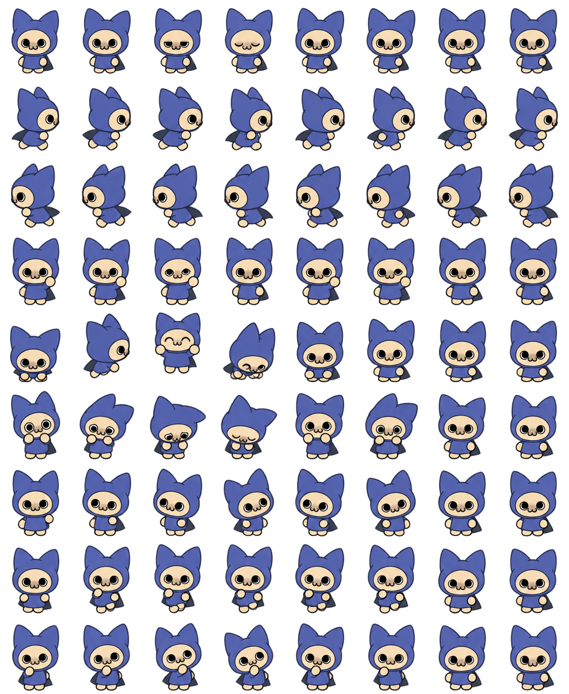

# 呆猫 · Codex Pet

把《怪物猎人》里深受玩家喜爱的呆猫，变成一只会发呆、会思考、会陪你工作的 Codex 小伙伴。

**本项目由 AI 辅助制作。** 以呆猫表情包中的角色形象为参考，使用 OpenAI 内置图像生成工具重新绘制状态动作；项目整理、安装脚本和说明也由 AI 辅助完成。这不是对原 GIF 动作的逐帧复刻，也不是 OpenAI 官方宠物。

你可以直接安装本项目提供的呆猫，也可以把一张呆猫表情包交给支持图像参考的 AI，让它生成属于你的版本。



## 呆猫是谁？

大家熟悉的「呆猫」，对应卡普空（CAPCOM）《怪物猎人崛起：曙光》中的艾露猫外观形象 **Kit T.**。官方中文 DLC 名称是 **追加艾露猫外观装备“猫系列”**。卡普空在《曙光》第四次免费更新的介绍中，宣布它与其他《狩猎指南》角色一起作为追加外观 DLC 登场；这套外观本身是单独销售的付费内容。[卡普空官方更新介绍](https://news.capcomusa.com/2023/02/01/velkhana-brings-a-cold-snap-to-monster-hunter-rise-sunbreak-in-free-title-update-4/) · [Steam 中文商品页](https://store.steampowered.com/app/2167453/Monster_Hunter_Rise__Kit_T_Palico_layered_armor_set/?l=schinese)

它的来历还要更早一点：按官方设定，Kit T. 是水芸绘制的《狩猎指南》中的角色，是五兄弟姐妹中最小、也很爱吃东西的那个。DLC 把这个二维插画形象带进了游戏，让随从艾露猫可以换上整套造型。[任天堂官方商品介绍（发行商提供）](https://www.nintendo.com/us/store/products/kit-t-palico-layered-armor-set-70050000039041-switch/)

蓝紫色猫耳帽、圆圆的大眼睛和一本正经的呆萌神态，让它在玩家社区中收获了不少喜爱，也出现在视频和表情包创作中。社区会直接用「呆猫」称呼它，例如 B 站的[付费外观展示视频](https://www.bilibili.com/video/BV1Q24y1i7Wg/)。截至 **2026 年 9 月 21 日查询时**，该 DLC 的 Steam 中文页面显示 **510 篇评测、99% 好评**，为它受玩家欢迎提供了一个具体参考；评测数量和比例会随时间变化。[Steam 玩家评价](https://store.steampowered.com/app/2167453/Monster_Hunter_Rise__Kit_T_Palico_layered_armor_set/?l=schinese)

这个小项目就是想把它的呆萌劲儿带到桌面上：以呆猫表情包为参考，由 AI 重新设计适合 Codex 状态切换的动作。**原始角色来自 CAPCOM；本项目的宠物图像与适配由 AI 辅助制作，是非官方爱好者项目。**

## 直接使用现成的呆猫

从 GitHub 的 **Code → Download ZIP** 下载并解压本项目。

### Windows：安装脚本

在项目目录打开 PowerShell，运行：

```powershell
powershell -NoProfile -ExecutionPolicy Bypass -File .\scripts\install.ps1
```

脚本将 `pet/pet.json` 和 `pet/spritesheet.png` 复制到 `$CODEX_HOME/pets/daimao`；没有设置 `CODEX_HOME` 时使用用户目录下的 `.codex/pets/daimao`。如果已有同名文件夹，脚本会先备份到 `.codex/pet-backups` 再更新。

重新打开 Codex 的 **设置 → Pets**，选择「呆猫」。若仍显示旧图或没有出现，请退出并重新打开 Codex。

### 手动安装或替换

1. 在 Codex 配置目录的 `pets` 下新建 `daimao` 文件夹。
2. 把本项目 `pet` 文件夹里的 **两个文件一起复制进去**。
3. 在 Codex 中选择「呆猫」。

默认目录示例：

- Windows：`%USERPROFILE%\.codex\pets\daimao\`
- macOS / Linux：`~/.codex/pets/daimao/`（需客户端提供相同的自定义 Pets 功能）

如果希望替换已有的自定义宠物，先备份它的文件夹，再用本项目的两个文件覆盖其对应文件。保留原文件夹名称即可保留该本地宠物的标识。只替换图片时，请确保 `pet.json` 的 `spritesheetPath` 和版本号与图片匹配。

## 用表情包让 AI 生成自己的版本

1. 准备一张你想使用的呆猫表情包，交给支持参考图和透明背景输出的 AI。
2. 明确说明：**只参考角色形象，重新设计不同状态的动作，不要复刻表情包原有动作。**
3. 使用下面的示例需求，或参考完整的 [生成提示词](prompts/generate-spritesheet.txt)。
4. 检查生成图中的角色一致性、透明背景和逐帧动作，再整理成下方的精灵图格式。
5. 替换 `pet/spritesheet.png`，按需修改 `pet/pet.json` 的名称和描述，然后安装。

可以这样告诉 AI：

> 请以这张呆猫表情包的角色形象制作一个 Codex 自定义 pet。保留蓝紫猫耳帽、奶油色脸、大黑眼和呆萌表情，补全小身体；重新设计眨眼待机、左右奔跑、挥手、跳跃、出错、等待、工作和思考动作。不要沿用原 GIF 挥刀动作。输出真实透明背景的精灵图，并按项目提供的 8 列 × 9 行格式逐帧排版。请验证每格都完整、不串帧，再给出可安装的 pet.json 和 spritesheet.png。

AI 生成的图片不一定严格遵守网格或尺寸。本项目先生成状态图，再识别各角色区域、统一缩放并打包；直接把整张图拉伸到目标尺寸可能切断耳朵或混入相邻帧。动作自然度也需要结合动画预览人工检查。

## 动作与格式

使用 `spriteVersionNumber: 1`。精灵图是带透明通道的 PNG，尺寸 **1536 × 1872**，**8 列 × 9 行**，每格 **192 × 208**。

| 行（从 1 开始） | 状态 | 使用前几帧 | 表现 |
| --- | --- | --- | --- |
| 1 | idle | 6 | 发呆、呼吸、眨眼 |
| 2 | running-right | 8 | 向右奔跑 |
| 3 | running-left | 8 | 向左奔跑 |
| 4 | waving | 4 | 抬爪挥手 |
| 5 | jumping | 5 | 蹲下、跳起、落地 |
| 6 | failed | 8 | 惊讶、低头、恢复 |
| 7 | waiting | 6 | 张望、轻轻摇摆 |
| 8 | running | 6 | 专注地原地迈步 |
| 9 | review | 6 | 托腮、歪头思考 |

每行共保留 8 格，多余格为备用或重复帧。具体状态触发、循环和播放速度由 Codex 客户端控制；本项目提供对应的图像资产，不修改客户端逻辑。

这些格式来自制作时本机 Codex Windows **26.915.4065.0** 的客户端实现，并非稳定的公开 API 承诺。已检查图片尺寸、透明通道、72 个角色格及安装文件；尚未在客户端实测所有状态的触发。

## 本地预览与检查

下载后用浏览器打开 [preview.html](preview.html)，点击按钮查看各组动作。GitHub 文件页展示的是 HTML 源码，需下载后打开。

如果已安装 Node.js，可在项目根目录运行无依赖检查：

```sh
node scripts/validate.cjs
```

## 文件说明

```text
pet/                         可直接安装的文件
  pet.json                   名称、描述与格式版本
  spritesheet.png            九组动作精灵图
prompts/generate-spritesheet.txt  本次使用的完整生成提示词
scripts/install.ps1          Windows 安装脚本（自动备份已有版本）
scripts/validate.cjs         无依赖格式检查
preview.html                浏览器动画预览
```

## 制作说明

- 角色来源：CAPCOM《怪物猎人》系列的 Kit T.（“猫系列”艾露猫外观，玩家昵称「呆猫」）；制作时参考用户提供的表情包，项目未附原始 GIF。
- 图像生成：OpenAI 内置 `image_gen`，以角色参考重新绘制；完整提示词随项目提供。
- 整理与代码：由 Codex AI 辅助完成。
- 本项目不声称拥有原始角色设计的权利；AI 制作说明不代表原始角色由本项目原创。

